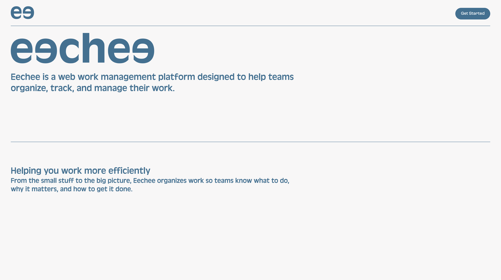
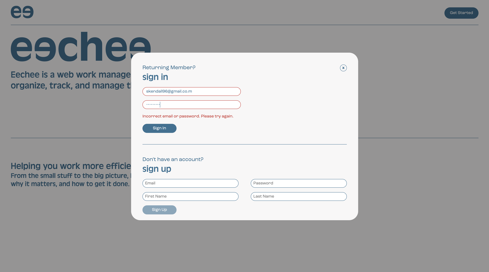
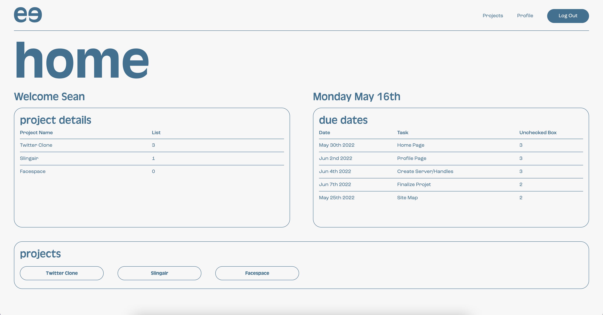
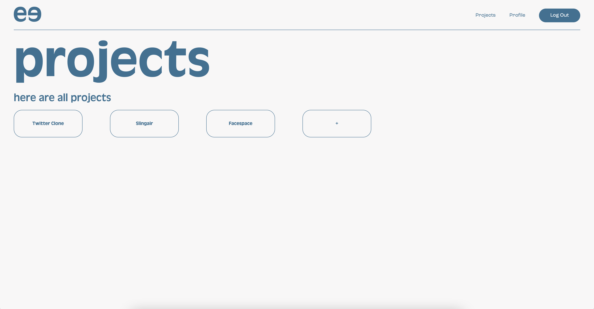
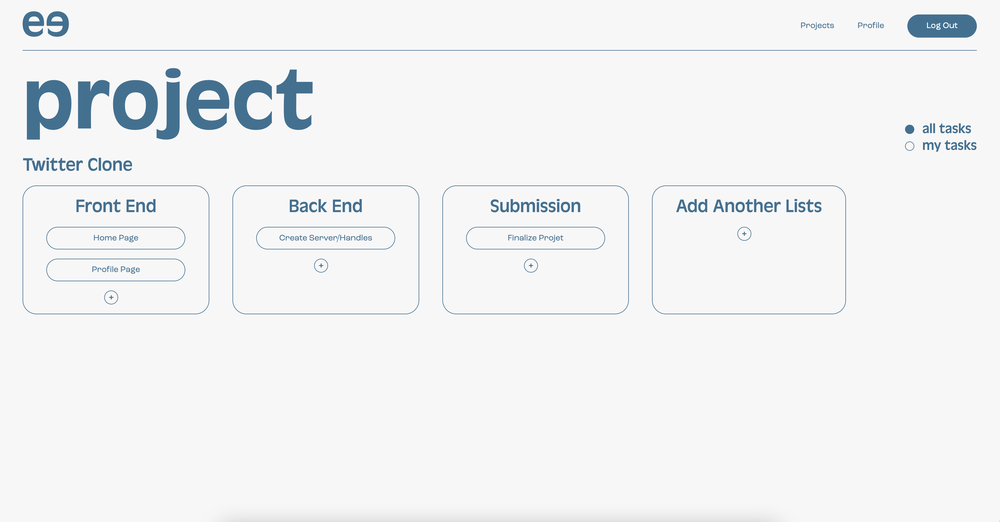
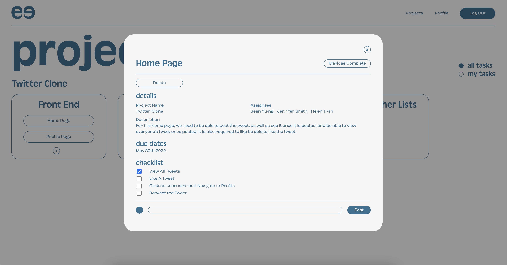
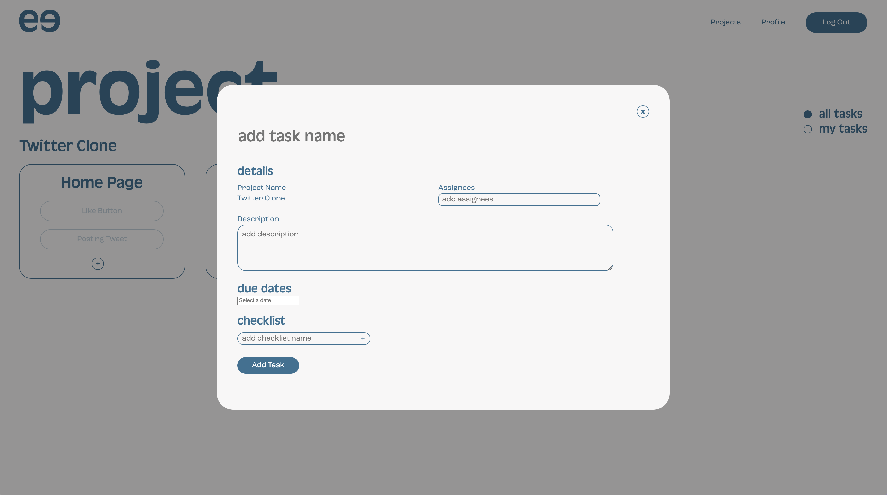
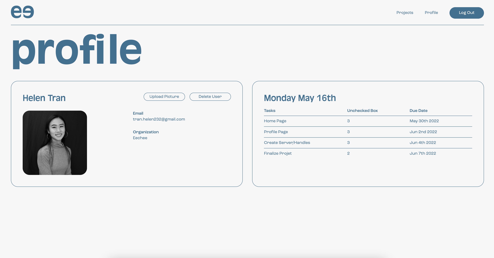

# Eechee

# Introduction

Eeechee is a MERN website still in development. In mandarin, eechee means together, which is the name of this website. It is a web based, work managing platform that help make the workflow more efficient.

To get started, in the terminal. Enter cd backend, and then hit yarn start. Then cd frontend, and hit yarn start as well.

# Project

## Coding Languages

Eechee web application uses React.js, Node.js as well as Mongo.db.

## The Application

The website is built with design in mind as, helps with managing workflow.

### 1. Homepage

On the homepage it explains the purpose of the site.

### 2. Login or Sign Up

During the game, you can use your keyboard to move the characters left and right in order to dodge the meteors falling. At the top left corner, there is a point tracker, that tracks every meteors that falls and adds a point to the game.

### 3. Home Page Logged In

Once the game is over, there is a restart button to enter back into a newly refreshed game.

### 4. All Projects

This pages shows all the projects of the organization

### 5. View Tasks for Project

You can view all the tasks for the project or filter to see the task assigned to the user that is logged in.

### 6. View Details of Each Tasks

In the detail section, you can view the description of the tasks, the assignees and the due date of the task. There's also a checklist included that shows the break down of the task. Under the checklist, you will find a comment section to communicate with teammates. This modal includes a delete button to delete a task, as well as a "mark as complete" button that will grey it out in the list.

### 7. Adding Tasks

In the adding task modal, the project name of the page is already defined. There are inputs to add the name of the tasks, add assignees as well a text box to enter the description for the project. There's a section to input a due date and adding checkboxes to a checklist.

### 8. Profile Page

On the profile page, the user can upload their profile picture or delete their account. They can also view their tasks assigned to them.

